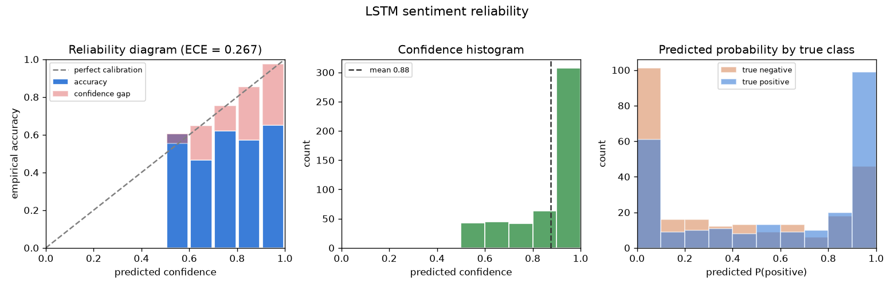

# text-sentiment-lstm

*Origin: Originally developed for the Machine Learning for Knowledge Service course at KAIST (Spring 2019); refactored and open-sourced in July 2026.*

A small, typed PyTorch library for binary sentiment classification with a
bidirectional LSTM. It ships a from-scratch word tokenizer, a trained model in a
single file, and calibration tooling that tells you when the model's confidence
should be trusted. The focus is a clean library surface and honest confidence,
not a leaderboard number.

## Use it

Load the committed pretrained model and classify text. This runs offline, no
download and no training.

```python
from sentlstm import SentimentClassifier

clf = SentimentClassifier.load("models/sentlstm_rt.pt")

pred = clf.predict_one("a heartfelt and beautifully acted film")
print(pred.label, round(pred.confidence, 2))
# positive 0.76

for p in clf.predict(["dull and far too long", "sharp, funny, and moving"]):
    print(p.label, round(p.confidence, 2))
```

Each `predict` call returns typed `Prediction` records with `label`, `label_id`,
`confidence`, and per-class `probabilities`. For a raw probability matrix use
`clf.predict_proba(texts)`, which returns a NumPy array of shape
`(n_texts, n_classes)`.

Run the bundled example against a few sample reviews:

```
python examples/classify_reviews.py
```

## Hero figure: is the confidence trustworthy

A classifier that says 0.9 should be right about 90 percent of the time. The
`calibration` module measures the gap and renders the project's hero figure.



On the committed sample this from-scratch model is clearly overconfident. It
piles its predictions up near probability 1.0 (mean confidence 0.88) while its
accuracy sits far lower, so the reliability bars fall below the diagonal and the
expected calibration error is large. This is the expected signature of a small
recurrent model trained without pretrained embeddings, and surfacing it is the
point of the figure.

```python
import numpy as np
from sentlstm import SentimentClassifier, load_csv, plot_reliability_diagram

clf = SentimentClassifier.load("models/sentlstm_rt.pt")
texts, labels = load_csv("data/sample_test.csv")
probs = clf.predict_proba(texts)
curve = plot_reliability_diagram(probs, np.array(labels), "results/reliability.png")
print("ECE", round(curve.ece, 3))
```

## Measured results

Produced this session by `python scripts/train_sample.py` on the committed
carved Rotten Tomatoes sample (1500 train, 500 test), 64-dim embeddings trained
from scratch, hidden size 64, 10 epochs, single fixed seed. Full numbers in
[results/metrics.json](results/metrics.json).

| metric | value |
| --- | --- |
| test accuracy | 0.618 |
| expected calibration error (ECE) | 0.267 |
| mean predicted confidence | 0.876 |
| vocabulary size | 2544 |
| model file size | 949 KB |

These are honest small-sample numbers, not a benchmark. On the full public
Rotten Tomatoes corpus the same architecture reaches about 0.73 test accuracy
(`python scripts/benchmark.py --dataset rt --epochs 8`); the point of the carved
sample is a fast, offline, reproducible run and a clear calibration story.

## Install

```
python -m venv .venv
.venv\Scripts\activate      # Windows, or: source .venv/bin/activate
pip install -e ".[dev]"
```

Requires Python 3.11 or newer. Torch is CPU only for the quickstart.

## API surface

| symbol | purpose |
| --- | --- |
| `SentimentClassifier` | load a `.pt`, `predict` / `predict_proba` / `save` |
| `Prediction` | typed record: label, label_id, confidence, probabilities |
| `Vocabulary`, `tokenize` | from-scratch word tokenizer and vocabulary |
| `LSTMClassifier` | the bidirectional LSTM module |
| `Trainer`, `set_seed`, `accuracy` | training loop and metrics |
| `build_dataset`, `collate_batch`, `load_csv` | data plumbing |
| `build_embedding_matrix` | optional GloVe warm start |
| `reliability_curve`, `plot_reliability_diagram` | calibration tooling |

Full walkthrough in [docs/usage.md](docs/usage.md).

## Reproduce

```
python scripts/train_sample.py --epochs 10        # offline: sample -> model, metrics, figure
python examples/classify_reviews.py               # offline: pretrained inference
pytest -q                                         # offline test suite
python scripts/download_data.py --outdir data     # optional: fetch full corpus
python scripts/benchmark.py --dataset rt          # optional: train on full corpus
```

## What it does not do

- No transformer or pretrained language model. This is a plain recurrent
  baseline, not a fine-tuned BERT.
- No multi-class or aspect-based sentiment. The task is binary sentence polarity.
- No hyperparameter search. The reported numbers come from a single fixed
  configuration.

## Layout

```
src/sentlstm/       tokenizer, data, embeddings, model, trainer, predict, calibration
scripts/            train_sample.py (offline), benchmark.py, download_data.py
examples/           classify_reviews.py + sample_reviews.txt
docs/               usage.md
notebooks/          demo.ipynb with executed outputs
models/             sentlstm_rt.pt, the committed pretrained model
data/               carved sample CSVs committed, full dataset gitignored
results/            reliability.png hero figure, metrics.json
tests/              pytest suite, runs fully offline
```

## Data

The committed sample is a class-balanced carve of the public Rotten Tomatoes
sentence-polarity dataset, not synthetic. See [data/README.md](data/README.md).

## Author

Aamir Malik

- GitHub: https://github.com/aamirmalik-dr
- LinkedIn: https://linkedin.com/in/dr-aamirmalik

## License

MIT, see LICENSE.
